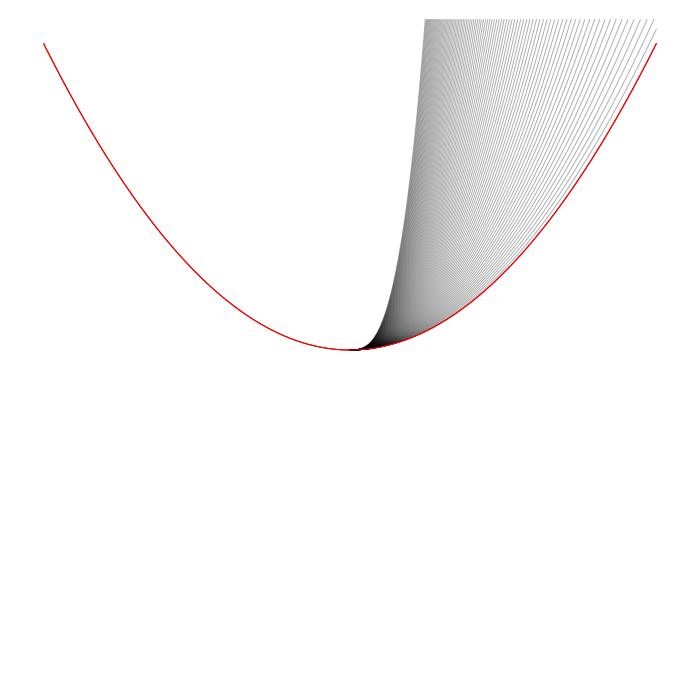
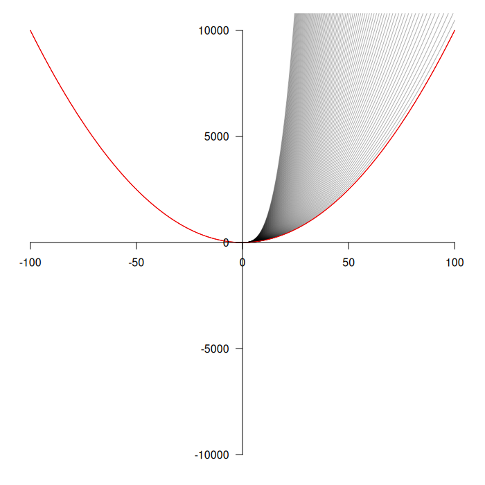

 
 

This is $f(x) = x^z \text{ for } z \in [2,3)$. For $z = 2$ (the red line), the function behaves as you would expect it to, creating a parabola. However, for $x < 0$ and non-integer values of $z$, the function produces complex numbers (they have real and imaginary parts), creating a problem for plotting (see below). 

